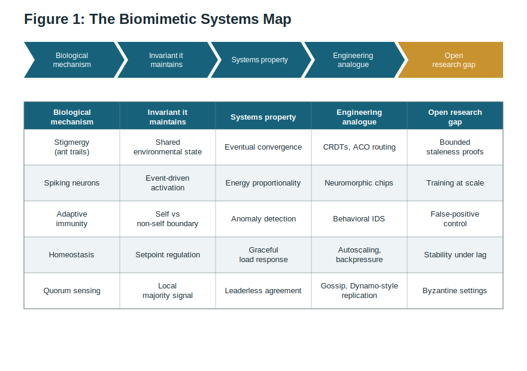
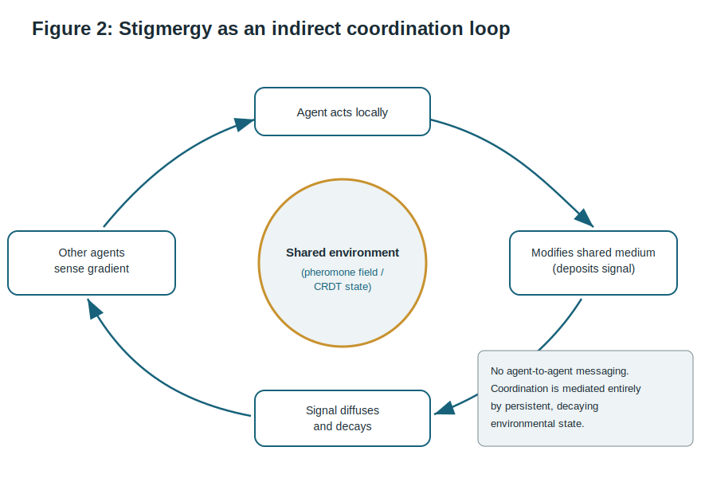
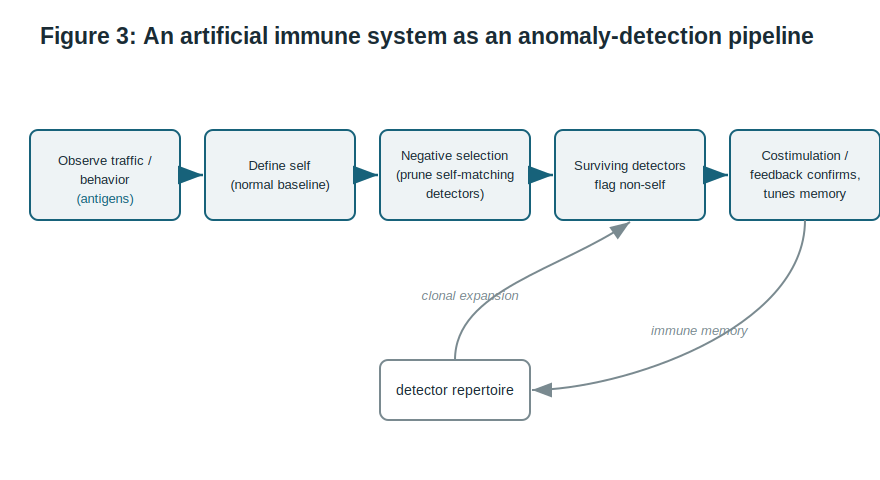
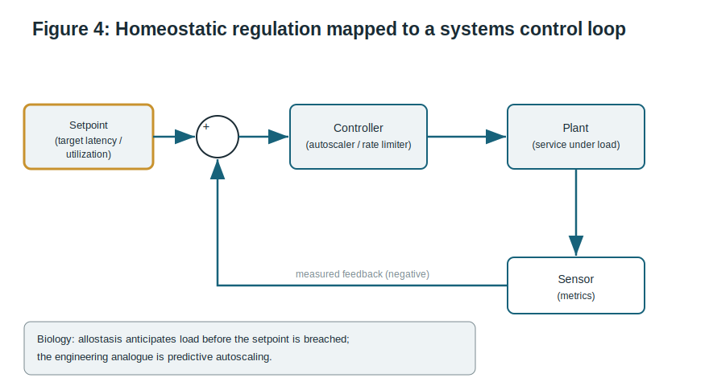

# Biomimetic Principles in Distributed and AI Systems: A Perspective on Nature-Inspired Architectures for Resilience and Efficiency

**Haseeb Mohammed Afsar**
ORCID: 0009-0000-4038-1272
Independent researcher

**Document type:** Perspective and narrative survey (preprint). Not peer reviewed.
**Suggested classification:** cs.DC (Distributed, Parallel, and Cluster Computing); cs.NE (Neural and Evolutionary Computing); cs.SE (Software Engineering).
**Version:** 0.1.0

---

## Abstract

Modern distributed and AI systems are converging on a small set of hard problems: staying available when parts fail, coordinating without a central bottleneck, detecting novel attacks, and doing all of this within a shrinking energy budget. Biology has been searching the same design space for roughly 3.8 billion years, and it has repeatedly converged on decentralized, feedback-driven, redundant architectures that degrade gracefully rather than fail catastrophically. This perspective argues that many nature-inspired computing ideas, often studied in isolation, share a common structure that becomes visible when they are placed side by side. We contribute the *Biomimetic Systems Map* (BSM), a five-column taxonomy that decomposes each biological strategy into the mechanism, the invariant it maintains, the systems property it yields, the closest modern engineering analogue, and the open research gap. We apply the map to five families of mechanisms: stigmergy, spiking computation, adaptive immunity, homeostasis, and quorum sensing. We then extract four shared design invariants, locality, redundancy, feedback, and degeneracy, that we argue are the actual transferable content of biomimicry for systems engineers, as distinct from surface-level metaphor. We are explicit about the limits of analogical reasoning and close with a research agenda framed as falsifiable questions rather than claims. This paper is intended as a preprint that synthesizes existing work and proposes future study, not as a report of new experimental results.

**Keywords:** biomimicry, bio-inspired computing, distributed systems, resilience, energy efficiency, stigmergy, neuromorphic computing, artificial immune systems, homeostasis, swarm intelligence.

---

## 1. Introduction

The engineering pressures on large-scale software have shifted. For two decades the dominant question was throughput: how to serve more requests per second. Today three other constraints bind at least as hard. First, **resilience**: systems are now large enough that partial failure is the normal operating condition, not an exception, so the useful question is not whether a component will fail but how the whole degrades when it does. Second, **coordination without a center**: as systems span regions and edge devices, any single point of coordination becomes both a latency floor and a failure domain. Third, **energy**: the marginal cost of computation is increasingly measured in watts and carbon, and the exponential appetite of large models has made energy proportionality a first-class design goal rather than an afterthought.

These are not new problems for biology. A colony, an immune system, and a nervous system all solve versions of exactly these constraints, under far harsher conditions than any datacenter, using no central controller and a strict energy budget. It is therefore unsurprising that computer science has borrowed from biology repeatedly: ant colony optimization, genetic algorithms, artificial neural networks, artificial immune systems, and swarm robotics are all decades old. What is less common is a treatment that asks what these borrowings have *in common*, and whether the shared structure, rather than any single metaphor, is the part worth transferring. An earlier, practitioner-facing sketch of this argument, aimed at a general engineering audience, appeared as an essay by the author [16]; the present paper formalizes that intuition and extends it into a testable framework.

This perspective makes three contributions.

1. **An organizing framework.** We introduce the Biomimetic Systems Map (Section 3), a taxonomy that forces each nature-inspired idea into the same five slots so that different mechanisms can be compared on equal terms.
2. **A structured survey.** We walk five mechanism families through the map (Sections 4 to 8), each mapped to a concrete, deployed engineering analogue rather than a hypothetical one.
3. **A synthesis into design invariants.** We argue (Section 9) that the transferable content of biomimicry reduces to four recurring invariants, and that a system exhibiting all four inherits robustness properties regardless of which biological story motivated it.

We are deliberately careful about epistemic status. Analogy between biology and engineering is a source of hypotheses, not of proofs, and the history of the field contains cautionary examples where a compelling metaphor outran its evidence. Section 10 treats this honestly. The goal here is to give practicing systems and AI engineers a compact mental model and a research agenda, not to claim that nature has already solved their problem for them.

## 2. Scope and method

This is a **narrative perspective**, not a systematic literature review. We selected mechanism families using three criteria: (i) the biological mechanism is well characterized and not folklore; (ii) there exists at least one deployed or widely studied engineering system that instantiates the same structural idea, so the analogy can be grounded rather than speculative; and (iii) the family illuminates at least one of the three binding constraints from Section 1 (resilience, decentralized coordination, energy). Five families met all three: stigmergy, spiking computation, adaptive immunity, homeostasis, and quorum sensing. We excluded families that are primarily optimization metaphors without a distinct systems-architecture footprint, such as most population-based metaheuristics, because our interest is architecture rather than search.

Because selection was purposive, coverage is illustrative rather than exhaustive, and the map should be read as a scaffold that invites additions, not as a closed classification. Section 10 discusses the resulting selection bias.

## 3. The Biomimetic Systems Map

The core observation motivating this paper is that most bio-inspired computing arguments compress several distinct claims into a single sentence such as "we route packets like ants." That sentence bundles a *mechanism* (pheromone deposition), an *invariant* the mechanism protects (a shared, decaying record of recent success), a *systems property* that emerges (convergence to good paths without global knowledge), an *engineering analogue* (ant colony optimization for routing), and an implicit *research gap* (formal guarantees on convergence time under churn). Bundling these hides where the analogy is strong and where it is merely evocative.

The Biomimetic Systems Map (Figure 1) separates them into five columns:

- **Biological mechanism.** The concrete process, described at the level a biologist would recognize.
- **Invariant it maintains.** The quantity or relationship the mechanism keeps stable. This is the load-bearing column, because an engineering analogue is only sound if it preserves the *same* invariant, not merely the same vocabulary.
- **Systems property.** The externally observable behavior that the invariant produces.
- **Engineering analogue.** A real system that already exhibits this structure, used as an anchor.
- **Open research gap.** What is not yet understood or guaranteed, stated so it can drive work.

*Figure 1. The Biomimetic Systems Map. Each row decomposes one biological strategy into mechanism, invariant, systems property, engineering analogue, and open gap. The "invariant" column is the test of whether an analogy is structural or merely lexical.*

The discipline the map imposes is the invariant column. If a proposed bio-inspired design cannot name the invariant it preserves, and show that its engineering realization preserves the same one, then the biological framing is decoration rather than justification. We use this test throughout.

## 4. Stigmergy and indirect coordination

**Mechanism and invariant.** Stigmergy is coordination through persistent modification of a shared environment rather than direct messaging. Ants deposit pheromone as they travel; the pheromone diffuses and decays; other ants bias their movement toward stronger gradients. The invariant maintained is a *shared, self-expiring record of recent collective success*. Crucially, decay is not a flaw to be engineered away; it is what keeps the record current and prevents the colony from locking onto stale paths.

**Systems property.** Large numbers of memoryless agents converge on good global solutions using only local reads and writes to shared state, with no agent holding a global view. The system is robust to individual agent loss because no agent is special.

**Engineering analogue.** Two anchors, at different layers. At the algorithm layer, ant colony optimization (ACO) applies this directly to routing and combinatorial problems. More interestingly for modern systems, the same invariant underlies **conflict-free replicated data types (CRDTs)** and gossip-based coordination: replicas modify shared, mergeable state and converge without coordination, and the merge function plays the role that pheromone chemistry plays in the colony. Both replace agent-to-agent consensus with agent-to-environment interaction (Figure 2).

*Figure 2. Stigmergy as an indirect coordination loop. Coordination is mediated entirely by persistent, decaying shared state, so the number of agents can grow without a corresponding growth in messaging.*

**Open gap.** Stigmergic systems trade strong consistency for availability and scale, and their convergence properties under continuous churn are understood empirically more than formally. The research gap is *bounded-staleness guarantees*: given a decay rate, an update rate, and a churn rate, what is the provable bound on how far the shared state can lag ground truth? CRDT theory gives eventual convergence but weaker real-time bounds, which is exactly the ant analogy's unproven promise.

## 5. Spiking computation and energy proportionality

**Mechanism and invariant.** Biological neurons do not compute on a clock. They are event-driven: a neuron integrates inputs and emits a spike only when a threshold is crossed, then falls silent. The invariant is *activity proportional to information*. Energy is spent when and where something changes, and idle circuitry costs almost nothing.

**Systems property.** Energy proportionality. A conventional synchronous processor pays for every clock tick whether or not useful work occurs; an event-driven substrate pays roughly in proportion to the events it processes. For sparse, bursty, or temporally structured signals this can be orders of magnitude more efficient.

**Engineering analogue.** Neuromorphic hardware realizes this directly with spiking neural networks and event-driven silicon, and event cameras apply the same principle to sensing by reporting per-pixel changes rather than full frames. The deeper lesson generalizes beyond neuromorphic chips: the same invariant motivates event-driven architectures, serverless scale-to-zero, and change-data-capture pipelines, all of which try to make cost track information rather than track wall-clock time.

**Open gap.** Training remains the bottleneck. Spiking networks lack a training method as mature and scalable as backpropagation on dense tensors, and the temporal credit-assignment problem is not fully solved at scale. Until event-driven substrates can be trained as readily as they can run, their efficiency advantage is confined to inference and to niches with naturally sparse signals. This is the honest ceiling on the analogy today.

## 6. Adaptive immunity and anomaly detection

**Mechanism and invariant.** The adaptive immune system distinguishes self from non-self. Through negative selection, immune detectors that react to the body's own molecules are eliminated during maturation, so the surviving repertoire responds only to novel, non-self patterns. Costimulation and clonal expansion then confirm real threats and build memory. The invariant is a *maintained boundary between normal and anomalous*, defined by exclusion rather than by an enumerated list of threats.

**Systems property.** Detection of *previously unseen* anomalies. Because the system is defined by what is normal rather than by a signature list of known bad patterns, it can flag novel attacks, which is precisely where signature-based defenses fail.

**Engineering analogue.** Artificial immune systems and, more broadly, behavior-based intrusion detection instantiate this pipeline (Figure 3): learn a baseline of self, generate detectors that do not match self, flag activity that trips a non-self detector, and use feedback to confirm and to update memory. This is structurally the same as modern anomaly-detection and UEBA (user and entity behavior analytics) systems, which model normal behavior and alert on deviation.

*Figure 3. An artificial immune system as an anomaly-detection pipeline. Defining the system by "self" rather than by a signature list is what lets it react to novel, non-self patterns.*

**Open gap.** The immune system pays a real cost for this generality: autoimmunity, the false-positive problem, where the boundary misclassifies self as threat. In engineering terms, behavioral detectors that alert on novelty drown operators in false positives when "normal" drifts. The research gap is *false-positive control under distribution shift*: how to keep a self-model current as legitimate behavior evolves, without either alert fatigue or a slow, exploitable adaptation window. Costimulation, a required second signal before a full response, is an underused idea here.

## 7. Homeostasis, allostasis, and control

**Mechanism and invariant.** Homeostasis holds internal variables such as temperature and pH within a viable band using negative feedback around a setpoint. Allostasis extends this: the organism *anticipates* load and adjusts before the setpoint is breached, for example raising heart rate ahead of exertion. The invariant is *regulation of a critical variable against disturbance*.

**Systems property.** Graceful response to load. Rather than running open-loop until saturation, a homeostatic system continuously corrects, and an allostatic one pre-corrects, so that disturbance produces adjustment instead of collapse.

**Engineering analogue.** This is the most directly transferable family, because control theory already formalizes it (Figure 4). Autoscaling, rate limiting, backpressure, and congestion control are all negative-feedback loops regulating a critical variable (utilization, latency, queue depth) around a setpoint. The allostatic extension is *predictive* autoscaling that provisions ahead of forecast demand rather than reacting after utilization crosses a threshold.

*Figure 4. Homeostatic regulation mapped to a systems control loop. The biological refinement, allostasis, corresponds to predictive control that acts before the setpoint is breached.*

**Open gap.** Feedback loops that regulate well in isolation can interact badly at scale: coupled autoscalers, retries, and load balancers can produce oscillation and metastable failure, where a system settles into a degraded stable state it cannot escape without operator intervention. The gap is *stability guarantees for interacting control loops under measurement lag*, a classical control problem that is under-applied in distributed systems practice.

## 8. Quorum sensing and leaderless agreement

**Mechanism and invariant.** Bacteria estimate local population density by sensing the concentration of signaling molecules they each emit, and switch collective behavior once a threshold concentration is reached. The invariant is *a decision gated on a local estimate of a global majority*, reached without any member counting the whole population.

**Systems property.** Coordinated, all-or-nothing group action triggered by locally sensed consensus, robust to the exact membership being unknown.

**Engineering analogue.** Quorum-based replication and gossip protocols are the direct analogue: a write or read is acknowledged once a threshold of replicas agree, and Dynamo-style systems make availability and consistency tunable through read and write quorum sizes. Leaderless replication generalizes this: no coordinator, decisions gated on locally observed thresholds.

**Open gap.** Quorum sensing in nature assumes cooperative signalers; biology also documents *cheaters* that exploit the signal without contributing. The engineering analogue is the Byzantine setting, where participants may lie about their state. Robust quorum mechanisms under adversarial or Byzantine participation, at the scale and latency budget of production systems, remain an active and incompletely solved area.

## 9. Synthesis: four invariants that actually transfer

Reading the five families through the map surfaces a claim stronger than any single analogy: the mechanisms differ, but the *invariants that make them robust* recur. We identify four.

1. **Locality.** Every mechanism acts on locally available state: a pheromone gradient, a neuron's own inputs, a detector's own matches, a sensed metric, a local signal concentration. Global knowledge is never assumed. Locality is what lets these systems scale without a coordination bottleneck.
2. **Redundancy.** No element is indispensable. Ants, neurons, detectors, and replicas exist in interchangeable multitudes, so the loss of any one is a non-event. Redundancy is the source of graceful degradation.
3. **Feedback.** Behavior is continuously corrected against an outcome: decay against staleness, thresholds against activity, costimulation against false positives, control loops against disturbance. Open-loop systems cannot self-stabilize; every robust biological system is closed-loop.
4. **Degeneracy.** Distinct components can perform the same function when needed. This is stronger than redundancy, which duplicates identical parts; degeneracy provides *different* paths to the same outcome, which is what confers robustness to novel, correlated failures that would take out identical replicas simultaneously.

The practical thesis is this: **a system that exhibits locality, redundancy, feedback, and degeneracy will inherit graceful degradation and decentralized scale regardless of which biological metaphor, if any, inspired it.** Conversely, a design that borrows biological vocabulary but violates these invariants, for example an "immune-inspired" detector that depends on a single central baseline (no redundancy, no locality), should not be expected to inherit the biological system's robustness. The invariants, not the metaphors, are the transferable content. This also reframes biomimicry for the practitioner: the value is less "copy this organism" and more "check your architecture against the four invariants that nature's robust systems all satisfy."

## 10. Limitations and threats to validity

This paper is a perspective, and its claims carry corresponding caveats.

- **Analogy is not evidence.** A structural resemblance between a biological mechanism and an engineering system generates a hypothesis; it does not establish that the biological understanding transfers. The invariant test in Section 3 is a guardrail against lexical analogy, but it does not by itself validate any specific design. Every row of the map should be read as "worth investigating," not "established."
- **Selection bias.** Mechanism families were chosen purposively for having clean engineering anchors. This inflates the apparent success rate of biomimicry by construction, because families where the analogy fails were not selected. A systematic review with predefined inclusion criteria would give a less flattering and more accurate base rate.
- **Biology is not optimal.** Evolution satisfices under historical constraints; it does not optimize. Some biological "solutions" are frozen accidents, and importing them can import their pathologies (autoimmunity, metabolic cost, slow adaptation). The four invariants are offered as the robust core precisely because they recur across otherwise unrelated mechanisms, but even they are a hypothesis about convergent design, not a theorem.
- **No new benchmark.** This work contributes a framework and a synthesis, not experimental results. The claims in Section 9 are testable but are not tested here. That is stated plainly so the paper is not mistaken for an empirical study.

## 11. Research agenda

We frame open questions as falsifiable propositions to invite disconfirmation.

- **P1 (Staleness).** For stigmergic and CRDT-based coordination, there exists a closed-form bound on shared-state staleness as a function of decay, update, and churn rates. *Test:* derive and empirically validate the bound on a gossip system under controlled churn.
- **P2 (Energy).** Event-driven substrates trained with a scalable temporal credit-assignment method can match dense-tensor accuracy on a non-sparse benchmark at strictly lower energy. *Test:* an apples-to-apples energy-versus-accuracy curve.
- **P3 (Detection).** A costimulation-style two-signal requirement reduces anomaly-detector false positives under distribution shift more than threshold tuning alone. *Test:* ablation on a drifting behavioral dataset.
- **P4 (Stability).** Interacting autoscaling and retry loops satisfy a provable stability criterion when measurement lag is below a derivable threshold. *Test:* control-theoretic analysis plus fault injection.
- **P5 (Invariants).** Among systems with comparable purpose, those satisfying all four invariants of Section 9 exhibit measurably better graceful degradation than those missing one. *Test:* a controlled failure-injection study scoring degradation curves against invariant coverage.

P5 is the load-bearing proposition: it is the empirical claim that would elevate the four invariants from an organizing heuristic to a validated design principle, and it is the natural next study.

## 12. Conclusion

Biomimicry in computing is often presented as a catalog of clever metaphors. We have argued that its durable value is structural rather than metaphorical. By decomposing five well-grounded mechanism families through a common Biomimetic Systems Map, the same four invariants surface repeatedly: locality, redundancy, feedback, and degeneracy. These, and not the biological vocabulary, are what confer resilience and decentralized efficiency, the properties modern distributed and AI systems most need. We have been explicit that this is a synthesis and a research agenda, not an experimental result, and that analogy is a source of hypotheses rather than of guarantees. The most useful takeaway for a systems or AI engineer is not to imitate any particular organism, but to audit an architecture against four invariants that billions of years of robust, decentralized, energy-constrained design keep rediscovering.

---

## References

[1] Dorigo, M., and Stützle, T. *Ant Colony Optimization.* MIT Press, 2004.

[2] Shapiro, M., Preguiça, N., Baquero, C., and Zawirski, M. "Conflict-free Replicated Data Types." *Symposium on Self-Stabilizing Systems (SSS)*, 2011.

[3] Bonabeau, E., Dorigo, M., and Theraulaz, G. *Swarm Intelligence: From Natural to Artificial Systems.* Oxford University Press, 1999.

[4] Maass, W. "Networks of spiking neurons: The third generation of neural network models." *Neural Networks*, 10(9), 1997.

[5] Davies, M., et al. "Loihi: A Neuromorphic Manycore Processor with On-Chip Learning." *IEEE Micro*, 38(1), 2018.

[6] Gallego, G., et al. "Event-based Vision: A Survey." *IEEE TPAMI*, 44(1), 2022.

[7] Forrest, S., Perelson, A. S., Allen, L., and Cherukuri, R. "Self-Nonself Discrimination in a Computer." *IEEE Symposium on Security and Privacy*, 1994.

[8] de Castro, L. N., and Timmis, J. *Artificial Immune Systems: A New Computational Intelligence Approach.* Springer, 2002.

[9] Cannon, W. B. *The Wisdom of the Body.* W. W. Norton, 1932.

[10] Sterling, P. "Allostasis: A model of predictive regulation." *Physiology and Behavior*, 106(1), 2012.

[11] Åström, K. J., and Murray, R. M. *Feedback Systems: An Introduction for Scientists and Engineers.* Princeton University Press, 2008.

[12] DeCandia, G., et al. "Dynamo: Amazon's Highly Available Key-value Store." *SOSP*, 2007.

[13] Miller, M. B., and Bassler, B. L. "Quorum Sensing in Bacteria." *Annual Review of Microbiology*, 55, 2001.

[14] Bramson, M., Lu, Y., and Prabhakar, B. "Randomized load balancing with general service time distributions." *SIGMETRICS*, 2010.

[15] Edelman, G. M., and Gally, J. A. "Degeneracy and complexity in biological systems." *PNAS*, 98(24), 2001.

[16] Afsar, H. M. "Biomimicry & the Evolution of Artificial Intelligence." *LinkedIn (essay)*, 2024. https://www.linkedin.com/pulse/biomimicry-evolution-artificial-intelligence-haseeb-afsar/

---

*Preprint prepared for open dissemination. Correspondence via the author's ORCID record. This version (0.1.0) is a perspective and narrative survey; it has not undergone peer review. Comments and disconfirming evidence are actively welcomed.*
